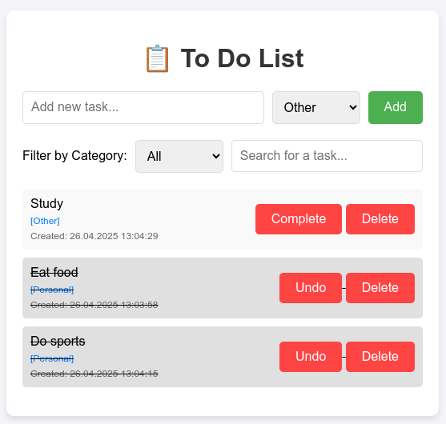

# 📋 To-Do List

A simple and functional task management application.  
It features a RESTful API backend built with **Spring Boot** and a minimalistic frontend using **HTML, CSS, and JavaScript**.  
The database (**PostgreSQL**) runs seamlessly inside a **Docker** container.

---

## 🚀 Features

- ✅ Add, list, update (mark as completed), and delete tasks
- 🕒 Automatically store the creation date of tasks
- 🗂️ Categorize tasks (e.g., Personal, Work, Shopping, Other)
- 🔍 Filter tasks by category
- 🔎 Search tasks by keyword
- 🎯 Simple, intuitive, and responsive interface
- 🐘 PostgreSQL database running inside a Docker container

---

## 🛠️ Technologies Used

**Backend:**
- Java 17
- Spring Boot
- Maven
- PostgreSQL

**Frontend:**
- HTML
- CSS
- JavaScript

**Database:**
- PostgreSQL (Dockerized)

---

## 📂 Project Structure

```
to-do-list/
├── backend/               # Spring Boot backend
│   ├── src/
│   ├── pom.xml
│   └── ...
├── frontend/              # HTML, CSS, JS frontend
│   ├── index.html
│   ├── styles.css
│   ├── script.js
│   └── ...
├── docker-compose.yml     # Docker configuration for PostgreSQL
└── README.md
```

---

## ⚙️ Setup Instructions

### Prerequisites

- Java 17
- Maven
- Docker and Docker Compose
- (Optional) Node.js and `live-server` for frontend development

---

### Step 1: Start the PostgreSQL Database

Navigate to the project root and run:

```bash
docker-compose up -d
```

This will start the PostgreSQL server in a Docker container.

---

### Step 2: Run the Backend

Navigate to the `backend/` directory and run the Spring Boot application:

```bash
cd backend
mvn spring-boot:run
```

The backend will start on [http://localhost:8080](http://localhost:8080) (or the port configured in `application.properties`).

---

### Step 3: Run the Frontend

Navigate to the `frontend/` directory and start the frontend server:

```bash
cd frontend
live-server
```

This will open the application in your default browser.

---

## 📸 Screenshots

| To Do List Ui |
|-------------|
|  |

---

## 🌐 API Documentation
Access the API documentation at: [http://localhost:8080/swagger-ui.html](http://localhost:8080/swagger-ui.html)


---

## 📜 License

This project is licensed under the [MIT License](LICENSE).

---

## 🙌 Acknowledgments

Built with ❤️ in Baku, Azerbaijan 🇦🇿

---
