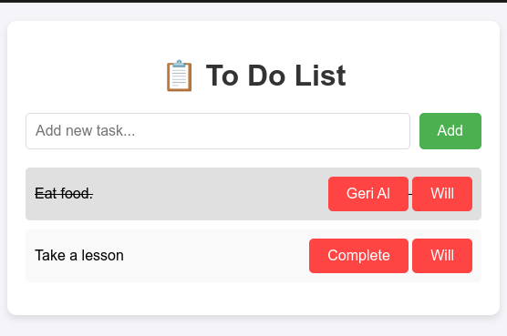

# 📋 To-Do List

A simple and functional task management application. The backend is built with Spring Boot (REST API), and the frontend is developed using HTML, CSS, and JavaScript. The PostgreSQL database runs inside a Docker container.

---

## 🚀 Features

- ✅ Add, list, update (mark as completed), and delete tasks  
- 🎯 Clean and user-friendly interface  
- 🐘 PostgreSQL database running in a Docker container  

---

## 🛠️ Technologies Used

**Backend:**
- Java 17  
- Spring Boot  
- Maven  

**Frontend:**
- HTML  
- CSS  
- JavaScript  

**Database:**
- PostgreSQL (Dockerized)

---

## 📂 Project Structure

```
to-do-list/
├── backend/               # Spring Boot backend
│   ├── src/
│   ├── pom.xml
│   └── ...
├── frontend/              # HTML, CSS, JS frontend
│   ├── index.html
│   ├── styles.css
│   ├── script.js
│   └── ...
├── docker-compose.yml     # Docker configuration for PostgreSQL
└── README.md
```

---

## ⚙️ Setup Instructions

### Prerequisites

- Java 17  
- Maven  
- Docker & Docker Compose  
- (Optional) Node.js with `live-server` for running the frontend  

---

### Step 1: Start PostgreSQL

Use Docker Compose to start the PostgreSQL container:

```bash
docker-compose up -d
```

---

### Step 2: Run the Backend

Navigate to the backend directory and start the Spring Boot application:

```bash
cd backend
mvn spring-boot:run
```

---

### Step 3: Run the Frontend

Navigate to the frontend directory and start the frontend using `live-server`:

```bash
cd frontend
live-server
```

Then open the provided URL in your browser (e.g., `http://localhost:8080`).

---

## 📸 Screenshot



*(Insert a screenshot of your application here)*

---

## 📜 License

This project is licensed under the [MIT License](LICENSE).

---

## 🙌 Acknowledgments

Built with ❤️ in Baku, Azerbaijan 🇦🇿

---
